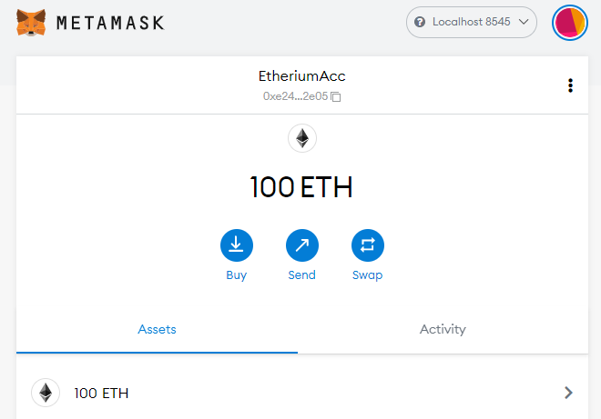

# Multi Blockchain Wallet in Python
## Background

Your new startup is focusing on building a portfolio management system that supports not only traditional assets
like gold, silver, stocks, etc, but crypto-assets as well! The problem is, there are so many coins out there! It's
a good thing you understand how HD wallets work, since you'll need to build out a system that can create them.

You're in a race to get to the market. There aren't as many tools available in Python for this sort of thing, yet.
Thankfully, you've found a command line tool, `hd-wallet-derive` that supports not only BIP32, BIP39, and BIP44, but
also supports non-standard derivation paths for the most popular wallets out there today! However, you need to integrate
the script into your backend with your dear old friend, Python.

Once you've integrated this "universal" wallet, you can begin to manage billions of addresses across 300+ coins, giving
you a serious edge against the competition.

### 1. Project setup
Test derive to make sure installation is all ok.

A look at the directory:

### 2. Setup constants
Set the constants for the coins.

### 3. Generate Mnemonic
This was stored as a variable in the .env file.

'scrub hawk timber mesh cinnamon labor imitate gospel scout tower okay scare'

### 4. Derive the wallet keys
Derive wallet keys & create a dictionary object for the coins.

### 5. Linking the transaction signing libraries
* priv_key_to_account - Used to convert the privkey to an account object that bit or web3.py can use to transact.
* create_tx - Creates the raw, unsigned transaction that contains all metadata needed to transact.
* send_tx - This calls create_tx to sign the transaction and then send it to the designated network.

### 6. Send some transactions!
Set up accounts to transact ETH and BTC
___
eth_acc = priv_key_to_account(ETH, eth_key)

btc_acc = priv_key_to_account(BTCTEST, btc_key)
___

### Accounts used in transactions!

---
Although everything compiled ok, I don't think the transactions transacted as they should have.  Will have to look in to this further once time permits.  I know I'm pretty close!
___